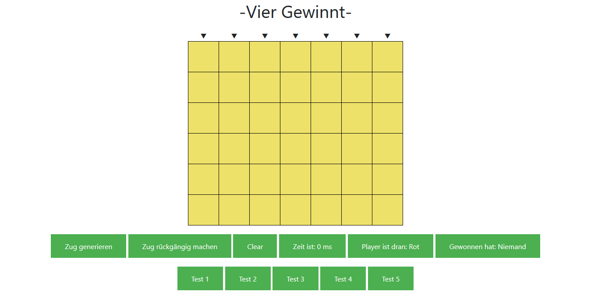

# Vier Gewinnt (PiS, SoSe 2020) 

Autor: Marcel Gode, 5277676

Ich habe die Zulassung für PiS im SoSe 2020 bei Herrn Herzberg erhalten.

## Inhaltsverzeichnis 

[TOC]


## 1. Einleitung

### Spielregeln

Vier Gewinnt ist ein zwei Personen Spiel, wobei jeder Spieler nacheinander einen Stein von oben in einer der 7 Spalte "fallen" lässt. Es darf pro Zug immer nur ein Stein gesetzt werden und die Position darf nur durch die Spalte bestimmt werden, nicht in der Reihe. Sobald ein Spieler 4 Steine nebeneinander in einer Reihe, in einer Spalte oder in der Diagonale besitzt, hat er gewonnen, danach ist das Spiel beendet. Es kann vorkommen, dass es keinen Sieger, also ein Unentschieden gibt.

### Bedienungsanleitung



Um einen Zug zu machen klickt man oben auf einer der Pfeile. Dabei wird auch immer unten angezeigt wer anfängt. Des weiteren wird ebenfalls unten angezeigt, wann ein Spieler gewonnen hat, sollte man dies nicht bemerken, so merkt man es spätestens wenn man keinen Zug mehr machen kann, da das Spiel dann zu Ende ist. Mit dem Button "Clear" kann man das Spielfeld zurücksetzten und von vorne beginnen oder man lädt die Seite neu. Mit dem Button "Zug rückgängig machen" kann man, wie der Name es schon vermuten lässt, einen Zug zurücksetzten. Mit dem Button "Zug generieren" kann man den PC einen Zug machen lassen. Nach dem Klick auf dem Button, berechnet er den bestmöglichsten Zug, dabei wird die Zeit gestoppt und in dem Feld "Zeit ist:" in Millisekunden ausgegeben. Betätigt man die Test Buttons, werden vordefinierte Tests auf der Konsole ausgegeben. Nicht auf dem Spielbrett im Browser! Wer Anfängt ist dem Spieler selber überlassen, wenn dann kann der Spieler beginnen oder er lässt den Computer den ersten Zug machen. Außerdem kann man mit einem Freund an einem Gerät zusammen gegeneinander antreten und sich Duellieren. 

## 2. Dateiübersicht

    \build.gradle
    \README.md
    \Screenshot.png
    \src\main\kotlin\App.kt
    \src\main\kotlin\Engine.kt
    \src\main\kotlin\GameEngine.kt
    \src\main\resources\data.txt
    \src\main\resources\public\index.html
    \src\main\resources\public\JavaScriptOwn.js
    
    -------------------------------------------------------------------------------
    Language                     files          blank        comment           code
    -------------------------------------------------------------------------------
    Kotlin                           3             32              1            431
    HTML                             1             11              0            143
    JavaScript                       1              6              0             60
    -------------------------------------------------------------------------------
    SUM:                             5             49              1            634
    -------------------------------------------------------------------------------
## 3. Dokumentation zur Spiel-Engine (ENG)

```
Feature    | AB  | H+S | MC  | eD  | B+I | Summe
-----------|-----|-----|-----|-----|------|----
Umsetzung  | 120 | 100 | 100 | 130 | 66.6 |
Gewichtung | 0.4 | 0.3 | 0.3 | 0.3 |  0.3 | 
Ergebnis   |  48 |  30 |  30 |  39 |   20 | **167%**

```

Die Spiel-Engine ist in der Datei "\src\main\kotlin\GameEngine.kt" zu finden und implementiert das Interface "Engine", zu finden in der Datei "\src\main\kotlin\Engine.kt". Da die Spiel-Engine eine voraus berechnete Datenbank benutzt, ist diese in der Datei "\src\main\resources\data.txt" zu finden.

Das Interface gibt der Spiel-Engine alle benötigten Funktionen vor raus, die für ein perfekt Funktionierendes Spiel benötigt werden.

```
interface Engine {
    fun min(tiefe: Int, alpha: Int, beta: Int): Int 
    fun max(tiefe: Int, alpha: Int, beta: Int): Int
    fun giveBitboardPlayer(player: Boolean): Long
    fun generatePossibleMoves(): ArrayList<Int>
    fun isWin(bitboard: Long): Boolean
    fun mirrorMove(move: Int): Int
    fun mirrorBitboard(bitboard: Long): Long
    fun removeMove()
    fun monteCarlo(): Int
    fun givePlayer(): Boolean
    fun makeMove(col: Int): Boolean
    fun saveHashmap()
    fun giveHashmap()
    fun generateHashmap()
    fun calculateBestMove(): Int
}
```


Zu Beginn der Datei der Spiel-Engine werden, vorerst die `java.io.File` Bibliothek importiert und die Variablen deklariert. Die Liste `previouseMov` speichert alle vorigen Züge, die bisher getätigt wurden, als Objekte ab. Im Gegensatz dazu speichert `savedMove` nur den bestmöglichsten Zug (die Spalte wo der Zug getätigt werden soll), der von der Engine errechnet wurde, ab. `savedMove2` speichert hingegen die genaue Stelle ab wo der Zug gemacht werden soll, damit später in der GUI der richtige Bereich ausgewählt werden kann. `Counter` zählt die getätigten Züge mit. `bitBoardPlayerX` und `bitBoardPlayerO` werden die Spielbretter pro Spieler als Longs abgespeichert, dies ermöglicht es schnell und einfach durch binäre Operationen bei der Veränderung der Boards, im Gegensatz zu einem Array, Rechenzeit zu sparen. Die `height` speichert in einem Array die höhe der Spalten ab. Der `heightCounter` zählt die getätigten Züge in der spalte mit. Zuletzt gibt es noch die `winHashMap` und die `favdepth`. Die `winHashMap` speichert alle Gewinnzüge ab die der Alpha-Beta Algorithmus findet, dabei nimmt er als Key die Bitboards als String und speichert dazu den Zug und die Tiefe ab, aber mehr dazu im späteren Verlauf.  `favdepth` speichert die gewünschte Tiefe ab, bis wohin der Alpha-Beta Algorithmus gehen soll.

```
import java.io.File
class GameEngine : Engine {
    var previouseMove: ArrayList<GameEngine> = ArrayList<GameEngine>()
    var savedMove: Int = 0
    var savedMove2: Int = 0
    var counter: Int = 0
    var bitBoardPlayerX: Long = 0L
    var bitBoardPlayerO: Long = 0L
    var height: IntArray = intArrayOf(0, 7, 14, 21, 28, 35, 42)
    var heightCounter: IntArray = intArrayOf(0, 0, 0, 0, 0, 0, 0)
    var winHashMap = HashMap<String, Pair<Int, Int>>()
    var favdepth = 10
```


Die Bitboards spiegeln das Spielbrett wie folgt ab:

```
  6 13 20 27 34 41 48   55 62     Additional row
+---------------------+ 
| 5 12 19 26 33 40 47 | 54 61     top row
| 4 11 18 25 32 39 46 | 53 60
| 3 10 17 24 31 38 45 | 52 59
| 2  9 16 23 30 37 44 | 51 58
| 1  8 15 22 29 36 43 | 50 57
| 0  7 14 21 28 35 42 | 49 56 63  bottom row
+---------------------+
```

Dabei werden alle Zahlen von 48 bis 63 und die Zahlen 6, 13, 20, 27, 34, 41 ignoriert. Dies sind die Binären Stellen eines Longs, welche jeweils den Wert 1 oder 0 annehmen können. Daher fängt auch die Variable `height` nicht mit 0 in den spalten an, sondern mit den Positionen auf dem Spielbrett.

Grundlegend gibt es drei verschiedene Konstruktoren: `constructor()` , `constructor(savedMove: Int, savedMove2: Int, counter: Int, bitBoardPlayerX: Long, bitBoardPlayerO: Long, height: IntArray, heightCounter: IntArray)` und `constructor(winHashMap: HashMap<String, Pair<Int, Int>>)`. Damit können dann Objekte erzeugt werden, bei denen spezielle Daten benötigt werden.

Des weiteren gibt es Funktionen die zur Benutzung der Bitboards benötigt werden: 

```
 	override fun isWin(bitboard: Long): Boolean {
        val directions = intArrayOf(1, 7, 6, 8)
        for (direction in directions) if (bitboard and (bitboard shr direction) and (bitboard shr (2 			* direction)) and (bitboard shr (3 * direction)) != 0L)
            return true
        return false
    }
    override fun generatePossibleMoves(): ArrayList<Int> {
        var moves = ArrayList<Int>()
        val top = 0b1000000_1000000_1000000_1000000_1000000_1000000_1000000L
        for (col in 0..6) {
            if (top and (1L shl height[col]) == 0L) moves.add(col)
        }
        return moves
    }
    override fun giveBitboardPlayer(player: Boolean): Long {
        var giveBitBoard = bitBoardPlayerX
        if (player) giveBitBoard = bitBoardPlayerO
        return giveBitBoard
    }
    override fun removeMove() {
        this.bitBoardPlayerX = previouseMove[previouseMove.size - 1].bitBoardPlayerX
        this.bitBoardPlayerO = previouseMove[previouseMove.size - 1].bitBoardPlayerO
        this.height = previouseMove[previouseMove.size - 1].height
        this.heightCounter = previouseMove[previouseMove.size - 1].heightCounter
        this.counter = previouseMove[previouseMove.size - 1].counter
        this.savedMove = previouseMove[previouseMove.size - 1].savedMove
        this.savedMove2 = previouseMove[previouseMove.size - 1].savedMove2
        this.previouseMove.removeAt(previouseMove.size - 1)
    }
    override fun makeMove(col: Int): Boolean {
        if (heightCounter[col] < 6) {
            previouseMove.add(
                GameEngine(
                    savedMove,
                    savedMove2,
                    counter,
                    bitBoardPlayerX,
                    bitBoardPlayerO,
                    height.copyOf(),
                    heightCounter.copyOf()
                )
            )
            savedMove2 = height[col]
            val move = 1L shl height[col]++
            heightCounter[col]++
            if (givePlayer()) bitBoardPlayerO = bitBoardPlayerO xor move
            else bitBoardPlayerX = bitBoardPlayerX xor move
            counter++
            return true
        }
        return false
    }
    override fun givePlayer(): Boolean {
        if (counter % 2 == 0) return true     //true ist O
        return false                        //false ist X
    }
```

`isWin(bitboard: Long)`gibt für die Eingabe eines Bitboards ein "true" aus, wenn ein Gewinn auf dem Bitboard gefunden wurde und ein "false", wenn keiner gefunden wurde. So kann man sich leicht den Gewinn für jeden spieler ausgeben lassen. `generatePossibleMoves(): ArrayList<Int>` gibt eine Liste mit allen möglichen Zügen aus indem geprüft wird, ob eine Spalte schon am oberen Rand angekommen ist, ist dies nicht der Fall wird der Zug für die spalte hinzugefügt. `giveBitboardPlayer(player: Boolean): Long` gibt für die Eingabe des Spielers das dazugehörige Bitboard aus. Um den Spieler auszugeben benutzt man dann einfach `givePlayer(): Boolean`, hierfür wird der Counter benötigt, wenn der Wert gerade ist wird "True" für den Spieler X ausgegeben, ist er ungerade wird "false" für Spieler O ausgegeben. Zuvor legt man fest welches Bitboard zu welchen Spieler gehört. Um einen Zug zu machen benutzt man `makeMove(col: Int): Boolean`, hier wird das derzeitige Objekt abgespeichert in die `previouseMove` Liste. Dabei wird ein neues Objekt erzeugt um zu verhindern, dass das Objekt immer auf die gleiche Speicherstelle zeigt. Dann werden die Counter hochgezählt und der Move mit dem Bitboard, des Spielers der gerade dran ist, verknüpft. Wenn ein Zug gemacht werden konnte gibt er "true" zurück, andernfalls "false", wenn er kein Zug machen konnte lag es daran, dass die Spalte voll ist. `removeMove()` macht den letzten Zug rückgängig in dem er aus `previouseMove` das letzte Element nimmt und die Werte aus dem Objekt in die Variablen abspeichert, danach löscht er das Element da es nicht mehr benötigt wird.

Eine große Besonderheit der Spiel-Engine ist die Hashmap mit der dazugehörigen Datenbank und der Spiegelung an der mittleren Achse. Um die beiden Funktion gut miteinander zu kombinieren gibt es ein paar Funktionen:

```
    override fun mirrorBitboard(bitboard: Long): Long {
        var arr = longArrayOf(
            0b0000000_0000000_0000000_0000000_0000000_0000000_0111111L,
            0b0000000_0000000_0000000_0000000_0000000_0111111_0000000L,
            0b0000000_0000000_0000000_0000000_0111111_0000000_0000000L,
            0b0000000_0000000_0000000_0111111_0000000_0000000_0000000L,
            0b0000000_0000000_0111111_0000000_0000000_0000000_0000000L,
            0b0000000_0111111_0000000_0000000_0000000_0000000_0000000L,
            0b0111111_0000000_0000000_0000000_0000000_0000000_0000000L
        )
        val bitboardMirror =
            ((arr[0] and bitboard) shl (42)) xor ((arr[1] and bitboard) shl (28)) xor ((arr[2] and
            bitboard) shl (14)) xor (arr[3] and bitboard) xor ((arr[4] and bitboard) shr (14)) xor
            ((arr[5] and bitboard) shr (28)) xor ((arr[6] and bitboard) shr (42))
        return bitboardMirror
    }
    override fun mirrorMove(move: Int): Int {
        return 6 - move
    }
    override fun generateHashmap() {
        for (i in 0..10) {
            var temp = 0
            while (!isWin(bitBoardPlayerO) && !isWin(bitBoardPlayerX) && counter != 42) {
                makeMove(calculateBestMove())
                makeMove(generatePossibleMoves().shuffled()[0])
                temp += 2
            }
            for (i in 1..temp)
                removeMove()
        }
        saveHashmap()
        for (i in 0..10) {
            var temp = 0
            while (!isWin(bitBoardPlayerO) && !isWin(bitBoardPlayerX) && counter != 42) {
                makeMove(generatePossibleMoves().shuffled()[0])
                makeMove(calculateBestMove())
                temp += 2
            }
            for (i in 1..temp)
                removeMove()
        }
        saveHashmap()
        for (i in 0..10) {
            var temp = 0
            while (!isWin(bitBoardPlayerO) && !isWin(bitBoardPlayerX) && counter != 42) {
                makeMove(calculateBestMove())
                temp += 1
            }
            for (i in 1..temp)
                removeMove()
        }
        saveHashmap()
    }
    override fun giveHashmap() {
        var temp = ArrayList<String>()
        File("src/main/resources/data.txt").forEachLine { temp.add(it) }
        for (i in temp.indices) {
            val elements = temp[i].split(",")
            val key = elements[0]
            winHashMap[key] = Pair(elements[1].trim().toInt(), elements[2].trim().toInt())
        }
    }
    override fun saveHashmap() {
        File("src/main/resources/data.txt").printWriter().use { out ->
            winHashMap.forEach {
                out.println("${it.key}, ${it.value.first}, ${it.value.second}")
            }
        }
    }
```

Die Hashmap speichert nur Gewinnzüge ab die der Alpha-Beta Algorithmus  findet, daher wird sie auch nur zum speichern im Alpha-Beta Algorithmus aufgerufen, dazu beim Alpha-Beta mehr. Da das Spielfeld an der mittleren Achse gespiegelt werden kann, gilt der Gewinnzug auch als Gewinnzug wenn das Spielfeld gespiegelt wurde. Um den Zug gespiegelt abspeichern zu können, müssen zum einen die Bitboards und der Zug gespiegelt werden. Dazu gibt es die Funktionen `mirrorBitboard(bitboard: Long): Long` und `mirrorMove(move: Int)`.  `mirrorMove(move: Int)` ist sehr simple, da die Spalten von 0-6 gehen, also 0 mitgezählt, reicht es 6 minus den Zug zu rechnen, z.B. Spalte 1 ist gespiegelt spalte 5 also `6-1=5`.  `mirrorBitboard(bitboard: Long): Long` gibt das übergebene Bitboard gespiegelt zurück, in dem er aus dem Bitboard jede Spalte mit einer vordefinierten Spalte "verunded", somit erhält er nur die Werte für diese Spalte und kann sie dann im Anschluss verschieben auf die gegenüberliegende Seite (gespiegelt). Um die Hashmap abspeichern zu können, in einer Datenbank, benötigt man die Funktion `saveHashmap()` und zum einlesen `giveHashmap()`. Hierfür wird nun die `java.io.File` Bibliothek benötigt. `saveHashmap()` speichert die Hashmap als Datenbank in eine ".txt" Datei, unter dem Pfad `src/main/resources/data.txt` ab. Dazu geht die Funktion jedes Element der Hashmap entlang und speichert es in einer neuen Zeile im Dokument ab, dabei trennt es den Schlüssel sowie die dazugehörenden Elemente mit einem Komma ab. `giveHashmap()` geht genau anders herum, es geht Zeile für Zeile das Dokument entlang und speichert die Werte wieder in der Hashmap ab, in dem er den String, von der Zeile, teilt bei den Kommas und die einzelnen Werte dann einliest. Das einlesen der Datenbank passiert dann jedes mal wenn der Server gestartet wird, so sind die Daten immer vorhanden. Man könnte auch jedes mal die Hashmap speichern, wenn ein neues Element hinzugefügt wurde, jedoch dauert das speichern ein wenig länger, dadurch würde die Performance/Reaktionsgeschwindigkeit leiden. Um jedoch trotzdem viele Werte hinzuzufügen, benötigt man die `generateHashmap()`Funktion. Diese spielt einfach 3 verschiedenen Spielarten, jeweils 10 mal durch. Die Erfahrung zeigte, dass mehr als 10 Spiele pro Spielart zu sehr langen Wartezeiten führten, deswegen ist es sinnvoller den Server häufiger neu zu starten und die Funktion immer wieder neu aufzurufen. Zwischen jeder Spielart wird die Hashmap gespeichert in die Datenbank. Die 3 Spielarten unterscheiden sich zwischen: 

1. Random Zug, dann ein besten Zug berechnen 
2. Erst ein besten Zug berechnen, dann ein Random Zug
3. nur ein besten Zug berechnen für jeden Spieler

So bekommt man viele verschiedene Daten, für die früheren Spielzüge und für die späteren.


Der Hauptbestandteil für das Programm, aber auch für die Hashmap und Datenbank ist der Alpha-Beta Algorithmus, dieser heißt im Code `max(tiefe: Int, alpha: Int, beta: Int): Int` und  `min(tiefe: Int, alpha: Int, beta: Int): Int` und beinhalten die Erweiterungen von Alpha und Beta.

```
override fun max(tiefe: Int, alpha: Int, beta: Int): Int {
        if (isWin(giveBitboardPlayer(givePlayer())))
            return 1 + tiefe
        if (generatePossibleMoves().size == 0 || tiefe == 0 ||
        	isWin(giveBitboardPlayer(!givePlayer())))
            return -1
        var maxWert = alpha
        var firstValue = Int.MIN_VALUE
        val possibleMoves = generatePossibleMoves().shuffled()
        for (i in possibleMoves.indices) {
            makeMove(possibleMoves[i])
            var wert = min(tiefe - 1, maxWert, beta)
            removeMove()
            if (wert > maxWert) {
                maxWert = wert
                if (tiefe == favdepth && wert >= 1) {
                    savedMove = possibleMoves[i]
                    winHashMap[("$bitBoardPlayerO:$bitBoardPlayerX")] = Pair(possibleMoves[i],
                    counter + tiefe)
                    winHashMap[("${mirrorBitboard(bitBoardPlayerO)}:${mirrorBitboard(
                    bitBoardPlayerX)}")] = Pair(mirrorMove(possibleMoves[i]), counter + tiefe)
                }
                if (wert >= 1 && wert >= firstValue) {
                    firstValue = wert
                    winHashMap[("$bitBoardPlayerO:$bitBoardPlayerX")] = Pair(possibleMoves[i],
                    counter + tiefe)
               		winHashMap[("${mirrorBitboard(bitBoardPlayerO)}:${mirrorBitboard(
               		bitBoardPlayerX)}")]=Pair(mirrorMove(possibleMoves[i]), counter + tiefe)
                }
                if (maxWert >= beta)
                    break
            }
        }
        return maxWert
    }
    
override fun min(tiefe: Int, alpha: Int, beta: Int): Int {
        if (isWin(giveBitboardPlayer(givePlayer())) || generatePossibleMoves().size == 0 || tiefe ==
        	0)
            return -1
        if (isWin(giveBitboardPlayer(!givePlayer())))
            return 1 + tiefe
        var minWert = beta
        val possibleMoves = generatePossibleMoves().shuffled()
        for (i in possibleMoves.indices) {
            makeMove(possibleMoves[i])
            val wert = max(tiefe - 1, alpha, minWert)
            removeMove()
            if (wert < minWert) {
                minWert = wert
                if (minWert <= alpha)
                    break
            }
        }
        return minWert
    }
```

Da der Alpha-Beta Algorithmus rekursiv ist, benötigt er zu beginn eine Abbruchbedingung. Wir beginnen mit der Funktion `max(tiefe: Int, alpha: Int, beta: Int): Int`. Zu Beginn wird geprüft ob der Spieler der den Alpha-Beta Algorithmus aufruft, schon gewonnen hat, ist dies der Fall gibt er `1 + die Tiefe` zurück. Danach wir geprüft ob die gewünschte Tiefe, in diesem Programm 10, erreicht wurde, es keine möglichen Züge mehr gibt oder ob der Gegner schon gewonnen hat, tritt eines davon ein gibt er `-1` zurück . Dann bekommt `maxWert` den wert von `alpha` und `firstValue` wird auf die kleinste Integer Zahl gesetzt. Zu Letzt werden die möglichen Züge generiert, im Anschluss durchmischt und in die Variable `possibleMoves`gespeichert. Gemischt wird um später einen Zufallszug zu machen, wenn es mehrere gleiche Gewinnzüge existieren, mit der gleichen Tiefe. Nun werden alle möglichen Züge durchlaufen, dabei wird in jedem Durchgang der jeweilige Zug ausgeführt und dann die Funktion `min(tiefe: Int, alpha: Int, beta: Int): Int` aufgerufen. `min(tiefe: Int, alpha: Int, beta: Int): Int` bekommt dann die Tiefe um 1 verringert übergeben und für `alpha`, `maxWert` und für `beta` auch `beta`von `max(tiefe: Int, alpha: Int, beta: Int): Int`. `min(tiefe: Int, alpha: Int, beta: Int): Int` macht die Züge für den Gegner und versucht auch den besten Zug zu finden. Daher rufen sie sich auch gegenseitig immer auf um gegeneinander zu spielen. `min(tiefe: Int, alpha: Int, beta: Int): Int` prüft zu beginn auch ober er/Gegner gewonnen hat, ob die gewünschte Tiefe erreicht wurde oder es keine möglichen Züge mehr gibt, trifft dies zu wird `-1` zurückgegeben. Danach Prüft `min(tiefe: Int, alpha: Int, beta: Int): Int` ob der andere Spieler schon gewonnen hat trifft dies zu wird `1 + die Tiefe` zurückgegeben. Hier werden nun auch wieder Variablen deklariert nur das dieses mal ein `minWert` gesetzt wird mit der Variable `Beta` und es werden auch wieder die möglichen Züge generiert, im Anschluss durchmischt und in die Variable `possibleMoves`gespeichert. Nun folgt der Ablauf ähnlich wie beim `max(tiefe: Int, alpha: Int, beta: Int): Int`. Gehen wir davon aus das am Ende der Rekursionen ein Wert zurückgegeben wird. Bei Rekursionen guckt man nur von der obersten Ebene hinauf und vertraut darauf das die richtigen Werte gegeben werden. Also bekommt `max(tiefe: Int, alpha: Int, beta: Int): Int` jetzt für jeden möglichen Zug einen Wert, dieser Wert ist Positiv wenn er damit gewinnt und negativ wenn er damit verliert. Nachdem er den Wert erhalten hat, wird der Zug wieder rückgängig gemacht, sonst würde im Anschluss die Abfolge der Züge nicht mehr stimmen. Ist dieser Wert größer als der `maxWert` , dann wird `maxWert` auf den neuen `wert` gesetzt. Nun folgen die wichtigen Bestandteile für die Hashmap und das Abspeichern des besten Zuges. Die erste Abfrage prüft ob der Algorithmus sich auf der obersten Ebene befindet und ob der `wert` größer oder gleich 1 ist, da wie gesagt nur ein positiver Wert ein Gewinnzug bietet. ist dies der Fall speichert er den möglichen Zug in die Variable `savedMove`. Nun wird dieser Zug auch in die Hashmap gespeichert und wie schon erwähnt auch gespiegelt abgespeichert. Als "key" wird für die Hashmap ein String verwendet bestehend aus den beiden Bitboards, die durch ein `:` getrennt werden, somit sin sie auch immer einzigartig. Zum spiegeln werden die bereits erwähnten Funktionen: `mirrorBitboard(bitboard: Long): Long`  und `mirrorMove(move: Int): Int` verwendet. Im Anschluss sollen auch schon die Gewinnzüge gespeichert werden, für die anderen Tiefen. Hier wird auch wieder überprüft ob der `wert` größer oder gleich 1 ist, nun kommt auch die Variable `firstValue` zum Einsatz um zu prüfen ob der voriger `wert`kleiner ist als der neue, dies geschieht dadurch, dass `firstValue` auf den `wert`gestzt wird, wenn die genannten Prüfungen `true` ergeben. Nun wird der Zug auch wieder zur Hashmap hinzugefügt. Wie bei vorigen werden die `keys` gleich erstellt und auch gespiegelt, bei beiden werden jeweils der Zug aber auch die Tiefe mit abgespeichert, um sicherzugehen das später wenn die Hashmap aufgerufen wird, um zu gucken ob ein wert drinnen ist, es immer noch die Tiefe größer ist als das Programm sich schon befindet. Es kann vorkommen das der Alpha-Beta Algorithmus einen perfekten Zug findet, aber in der Tiefe 11, wo er nicht suchen kann, sich ein besserer Zug befindet.


Sollte der Alpha-Beta Algorithmus keinen Gewinnzug finden so soll trotzdem ein starker gefunden werden. Dafür kommt nun der `monteCarlo(): Int` zum Einsatz. 

```
override fun monteCarlo(): Int {
        var winArray = ArrayList<Int>()
        var possibleMoves = generatePossibleMoves()
        var player = givePlayer()
        for (i in possibleMoves.indices) {
            makeMove(possibleMoves[i])
            winArray.add(0)
            for (k in 0..5000) {
                var temp = 0
                while (generatePossibleMoves().size != 0) {
                    if (isWin(giveBitboardPlayer(player))) {
                        winArray[i] = winArray[i] + 1
                        break
                    }
                    if (isWin(giveBitboardPlayer(!player)))
                        break
                    makeMove(generatePossibleMoves().shuffled()[0])
                    temp++
                    if (isWin(giveBitboardPlayer(player))) {
                        winArray[i] = winArray[i] + 1
                        break
                    }
                    if (isWin(giveBitboardPlayer(!player)))
                        break
                }
                for (j in 1..temp)
                    removeMove()
            }
            removeMove()
        }
        var move = 0
        var temp = 0
        for (i in winArray.indices) {
            if (winArray[i] >= temp) {
                temp = winArray[i]
                move = i
            }
        }
        return possibleMoves[move]
    }
```

Monte Carlo funktioniert so, dass er für jeden möglichen Zug das Spiel für eine gewisse Anzahl zu Ende spielt und dabei die Gewinne mit zählt. Die Erfahrung zeigte, dass ein Wert von 5000 Wiederholungen für Gewinnzüge sorgt und trotzdem schnell durchläuft. Wenn es möglich in jeder Spalte einen Zug zu machen dann spielt er 35000 Spiele zu Ende. Des Weiteren muss es einen Zähler geben um die getätigten Züge rückgängig machen zu können. Und am Ende gibt es eine Auswertung der Gewinne. Es wird dann der Zug genommen der die meisten Gewinne erzielt hat. Da Monte Carlo auf Statistik basiert, können die Werte nicht in die Hashmap abgespeichert werden, da sie auch mal falsch sein können (nicht perfekt).


Um die ganzen Funktionen sinnvoll zusammenzufassen und zu verwenden gibt es die Funktion `calculateBestMove():Int` mit der in einer Funktion der beste Zug generiert wird.

```
override fun calculateBestMove(): Int {
        savedMove = -1
        var key = ("$bitBoardPlayerO:$bitBoardPlayerX")
        if (winHashMap.containsKey(key) && winHashMap[key]!!.second >= counter) {
            savedMove = winHashMap[key]!!.first
        }
        if (savedMove == -1) {
            max(favdepth, Int.MIN_VALUE, Int.MAX_VALUE)
        }
        if (savedMove == -1) {
            savedMove = monteCarlo()
        }
        return savedMove
    }
```

Der gespeicherte Zug wird auf -1 gesetzt um zu unterscheiden wann ein Zug gesetzt wurde. Zu erst wird überprüft ob es die Ausganssituation in der Hashmap gibt, dazu wird der `key`wie schon zu vor beschrieben erstellt. Gibt es einen passenden Eintrag, wird der Zug genommen und der Alpha-Beta Algorithmus sowie der Monte Carlo übersprungen. So kann viel Zeit bei der Beantwortung gespart werden. Gibt es keinen Eintrag wird der zuerst der Alpha-Beta Algorithmus findet dieser auch keinen Gewinnzug, wird zuletzt der Monte Carlo aufgerufen, dieser liefert auf jeden Fall einen Wert.

## 4. Dokumentation zu den Test-Szenarien

```
Szenario |  1  |  2  |  3  |  4  |  5  | Summe
---------|-----|-----|-----|-----|-----|-------
ok       |  X  |  X  |  X  |  X  |  X  | 1.0
```

Die Tests werden wie folgt ausgeführt:

In der GUI wird der Button des gewünschten Tests gedrückt und auf der Konsole ausgeführt.

Die Tests befinden sich in der App.kt. Wird die Test funktion aufgerufen, wird ein neues Objekt = `game2` erstellt von der Klasse `GameEngine`, um das alte nicht zu verändern. Danach wird geprüft welcher Test aufgerufen wurde. Um die Ausganssituation zu erstellen wird die Funktion `game2.makeMove()` benutzt, sie wird so oft verwendet bis die Ausganssituation erreicht ist. Nun wird ein String erstellt um das Board zu visualisieren und es wird der Zug ausgegeben der als besten Gewinnzug gefunden wurde. Nun folgt noch der Beweis um zu zeigen dass der Zug wirklich den Gegner am siegen hindert oder dass er selber dadurch gewinnen wird.

Als Beispiel der Test 1: 

```
if (ctx.queryParam("id")!!.toInt() == 1) {
                var game2 = GameEngine(game.winHashMap)
                game2.makeMove(0)
                game2.makeMove(2)
                game2.makeMove(0)
                game2.makeMove(3)
                game2.makeMove(0)
                game2.makeMove(3)
                print("\n\n- Test 1: Start -\nAusgangssituation: \n---------\n|.......|\n|.......|\n|.......|\n|O......|\n|O..X...|\n|O.XX...|\n---------\nEngine (O) macht den Besten Zug, in Spalte (1-7): " + (game2.calculateBestMove() + 1) + ", da er dann Gewonnen hat.\nGewonnen O: ")
                game2.makeMove(game2.calculateBestMove())
                print("" + game2.isWin(game2.bitBoardPlayerO) + "\n- Test 1: Ende -\n")
            }
```

Die Testausführung protokolliert sich über die Konsole wie folgt:

```
- Test 1: Start -
Ausgangssituation: 
---------
|.......|
|.......|
|.......|
|O......|
|O..X...|
|O.XX...|
---------
Engine (O) macht den Besten Zug, in Spalte (1-7): 1, da er dann Gewonnen hat.
Gewonnen O: true
- Test 1: Ende -


- Test 2: Start -
Ausgangssituation: 
---------
|.......|
|.......|
|.......|
|OO.....|
|XOXX...|
|OXXO...|
---------
Engine (O) macht den Besten Zug, in Spalte (1-7): 3, da er dann nach 2 weiteren abwechselnden Zügen Gewonnen hat.
Gewonnen O: true
- Test 2: Ende -


- Test 3: Start -
Ausgangssituation: 
---------
|.......|
|.......|
|XX.....|
|OO.....|
|OO..X..|
|OXXXO..|
---------
Engine (O) macht den Besten Zug, in Spalte (1-7): 4, da er dann nach 4 weiteren abwechselnden Zügen Gewonnen hat.
Gewonnen O: true
- Test 3: Ende -


- Test 4: Start -
Ausgangssituation: 
---------
|.......|
|.......|
|.......|
|.......|
|O......|
|OO.X.XX|
---------
Engine (O) macht den Besten Zug, in Spalte (1-7): 5, da er dann den Gegner am gewinnen gehindert hat, nach 1 weiteren Zug.
Gewonnen X: false
- Test 4: Ende -


- Test 5: Start -
Ausgangssituation: 
---------
|.......|
|.......|
|..O....|
|.OX....|
|OOXO...|
|XXXO...|
---------
Engine (O) macht den Besten Zug, in Spalte (1-7): 4, da er dann den Gegner am gewinnen gehindert hat, nach 3 weiteren Zügen.
Gewonnen X: false
- Test 5: Ende -

```


## 5. Dokumentation der GUI

Für die Visualisierung wird in HTML eine Tabelle für das Spielbrett verwendet und Buttons für die weiter Interaktion. Um einen Stein zu legen, wurde der Tabellen Kopf mit `onclick=""` Funktionen belegt um zu gucken wo der Zug gemacht wurde, wird eine Variable übergeben, an die JavaScript Funktion.

```
<table class="center">
    <tr>
        <th onclick="drop('0')">▼</th>
```

Jede Zelle wird mit einer ID belegt um sie einfärben zu können. Dabei hat jede die CSS Eigenschaft einen Kreis in der Mitte zu besitzen, am Anfang sind alle in der Hintergrundfarbe gefärbt. Wird nun eine Spalte ausgewählt, Zug Rückgängig gemacht, alles zurückgesetzt oder ein Zug generiert wird an Hand der Zellen ID die passende eingefärbt.

```
 <tr>
        <td id="3"></td>
        <td id="10"></td>
        <td id="17"></td>
        <td id="24"></td>
        <td id="31"></td>
        <td id="38"></td>
        <td id="45"></td>
 </tr>
 
  td {
            background-color: #eee169;
            width: 70px;
            height: 70px;
            top: 100px;
            left: 250px;
            border: 1px solid black;
            text-align: center;
            border-radius: 100px;
        }  
        
  function drop(x) {
    http.open('GET', 'drop?' + 'id=' + x);
    http.send();
    http.onreadystatechange = function () {
        if (this.readyState == 4 && this.status == 200) {
            document.getElementById(this.responseText.split(",")[0]).style.backgroundColor = this.responseText.split(",")[1];
            info()
        }
    }
}
```

Die JavaScript Funktionen sind alle sehr Ähnlich aufgebaut. Sie senden ein `http` Request in dem der Name der Funktion steht, aber auch teilweise eine Variable mit übergeben wird, wie z.B. bei `drop(x)`. Es gibt 6 verschiedene Funktionen, zum einen 

- `drop(x)` um ein Zug zu machen und färbt diesen dann ein, 
- `test(x)` für die Test Buttons mit Übergabewert welcher Button gedrückt wurde, 
- `undoTurn()` färbt den letzten Zug wieder in die Hintergrundfarbe mit der Antwort von der `App.kt`, 
- `computerTurn()` lässt den Computer einen Zug machen und bekommt als Antwort von der `App.kt` die Zellen ID und die Farbe, 
- `clearAll()` löscht das ganze Board und 
- `info()` erneuert die Informationen für welche Spieler dran ist und wer gewonnen hat

Die ganze Logik hinter dem JavaScript übernimmt die `App.kt`, sie dient als Verbindung zwischen der Game-Engine und der GUI und übernimmt den Teil für die Entgegennahme von JavaScript, führt dann die Game-Engine aus und antwortet dann dem JavaScript wieder.

## 6.  Hinweise

Nachdem starten des Programms stellte ich fest, dass der erste Zug eine Weile dauerte, wenn ich jedoch den Zug rückgängig machte und ihn erneut generierte ging dies immer schneller. Ich denke dass liegt an der Performance meines Laptops, da dieser nur über 2,9 GB verfügbaren Ram verfügt und der CPU durchgängig auf 100% lief.

## 6. Quellenverzeichnis

https://github.com/denkspuren/BitboardC4/blob/master/BitboardDesign.md (31.07.2020)

https://de.wikipedia.org/wiki/Alpha-Beta-Suche (31.07.2020)

https://www.w3schools.com/css/css3_buttons.asp (31.07.2020)

https://www.html-seminar.de/kreis-erstellen-mit-css3.htm (31.07.2020)